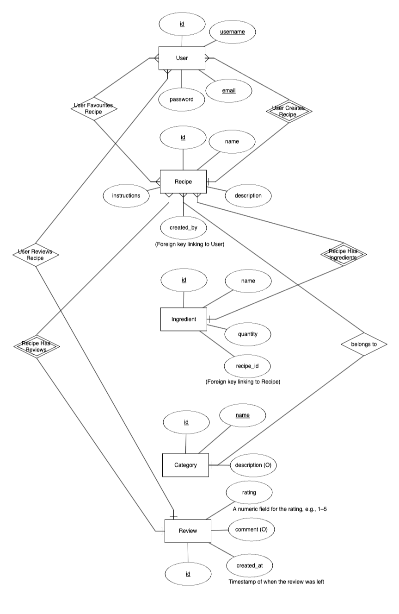

# Sizzle – Recipe Manager

## Table of Contents
1. [Overview](#overview)
2. [User Experience (UX)](#user-experience-ux)
    - [Strategy](#strategy)
    - [Scope](#scope)
    - [Structure](#structure)
    - [Skeleton](#skeleton)
    - [Surface](#surface)
    - [User Experience Enhancements](#user-experience-enhancements)
3. [Agile Development](#agile-development)
    - [Epics](#epics)
    - [User Stories](#user-stories)
    - [Tasks](#tasks)
    - [Acceptance Criteria](#acceptance-criteria)
4. [Features](#features)
5. [Database Schema](#database-schema)
6. [Testing](#testing)
    - [Automated Testing](#automated-testing)
    - [Manual Testing](#manual-testing)
    - [Unresolved Bugs](#unresolved-bugs)
7. [Deployment](#deployment)
8. [Project Setup](#project-setup)
9. [Version Control](#version-control)
10. [Credits](#credits)

---

## Overview

Sizzle is a Recipe Manager application designed to simplify the storage, retrieval, and management of recipes. It is aimed at cooking enthusiasts, chefs, and home cooks who need a simple, user-friendly platform to add, edit, view, and delete recipes while keeping track of their favourite dishes.

The main goals of this project are:
- To provide users with a seamless experience to manage their recipes.
- To create an efficient full-stack application with CRUD functionality.
- To ensure the application is secure, responsive, and easy to use.

**Target Audience**:
- Cooking enthusiasts
- Chefs and culinary professionals
- Home cooks

**Purpose**:  
Sizzle provides a platform where users can manage their recipes in an intuitive and easy-to-navigate interface, with full control over the CRUD functionalities of the recipes.

---

## User Experience (UX)

### Strategy
The strategy was to design an application that provides value to users who want to manage their recipe collections. This includes adding, updating, deleting, and favouriting recipes, as well as viewing all available recipes.

### Scope
The scope focuses on core functionalities such as:
- User registration, login, and logout.
- Adding and managing recipes with CRUD functionality.
- Search and filtering options to quickly find recipes.
- User feedback through form validations and process confirmations.

### Structure
The structure follows a clear and intuitive navigation system, allowing users to easily find the functionality they need.

### Skeleton
Wireframes were used during the design phase to ensure the layout is clear and responsive.

### Surface
The visual design follows modern design principles, utilising Bootstrap to ensure responsiveness and accessibility. The colour scheme and typography were chosen to reflect a clean and minimalistic approach.

### User Experience Enhancements

#### URL Slugs for Recipe Details
To enhance the user experience and improve SEO (Search Engine Optimisation), we implemented a URL slug feature for individual recipe pages. Instead of displaying the recipe ID or a generic query parameter in the URL, users can now see a human-readable URL that includes the recipe title. This not only makes the URLs more descriptive but also easier to share.

For example, when a user clicks on a recipe, the URL changes from:

`/recipes/1` to `/recipes/chocolate-chip-cookies`

**Steps taken:**
1. **Slug Field in the Model:** We added a slug field to the `Recipe` model, which automatically generates a URL-friendly version of the recipe title.
2. **Slug Generation:** Slugs are generated using Django's `slugify` function when a recipe is created or updated.
3. **URL Configuration:** The recipe detail page's URL pattern was updated to accept slugs instead of the numeric ID, ensuring a cleaner and more user-friendly URL structure.
4. **Navigation Links Updated:** All links to individual recipes were updated to point to the new slug-based URLs.

This enhancement improves the website's usability, makes URLs more memorable, and optimizes the site for search engines.
---

#### Pagination for Recipes
We implemented pagination to break down the list of recipes into multiple pages. This improves loading performance and provides a more structured browsing experience for users. By default, the recipe listing page now shows a limited number of recipes per page, with controls to navigate between pages.

#### Cloudinary Integration
We integrated Cloudinary for image hosting, which allows you to upload and display high-quality images for recipes. This enhances the visual appeal of the site, especially on the recipe detail pages, where images are displayed.

#### Heroku Deployment
The project is deployed on Heroku, and we ensured that the necessary environment variables (like the Cloudinary API keys) are set correctly in Heroku’s configuration to support image hosting and ensure smooth functionality.

#### Dropdown Menu for Recipe Categories
A dropdown menu was added to allow users to view and select categories when they visit a recipe’s page. This categorisation helps users quickly identify and navigate between different types of recipes, like “Dessert,” “Main Course,” or “Vegetarian.”

#### Fixing Static File and CSS Issues on Heroku
We encountered issues with CSS and image formatting when deployed to Heroku. These issues were resolved by ensuring that static files were properly collected and that Cloudinary image URLs were correctly configured.


## Agile Development

### Epics
The development process was guided by the following epics:
1. Manage Recipes (CRUD functionalities).
2. User Authentication (Registration, Login, Logout).
3. Search and Filter Recipes.

### User Stories
1. Add a recipe  
   As a user, I want to be able to add a new recipe so that I can manage my favourite dishes.
2. View all recipes  
   As a user, I want to view all recipes, so I can browse and find new dishes to cook.
3. Edit a recipe  
   As a user, I want to edit an existing recipe, so I can update details like ingredients or instructions.
4. Delete a recipe  
   As a user, I want to delete a recipe that I no longer need.
5. Search for a recipe  
   As a user, I want to search for a recipe based on a keyword or ingredient.

### Tasks
Tasks for each user story were broken down into manageable sections and completed iteratively. You can view the detailed breakdown of tasks on the GitHub project board.

### Acceptance Criteria
Each user story includes specific acceptance criteria to ensure functionality works as expected. This includes feedback loops, data validation, and user notifications.

---

## Features

Sizzle includes the following key features:
- **Recipe Management**: Add, edit, and delete recipes.
- **Search Functionality**: Search for recipes based on keywords.
- **Favourite Recipes**: Mark recipes as favourites for quick access.
- **User Authentication**: Secure registration, login, and logout.

---

## Data Schema / ERD

The following Entity Relationship Diagram (ERD) illustrates the data model for the Sizzle application, showcasing the relationships between different entities.


<p>Entity Relationship Diagram (ERD).</p>

### Description of Entities

- **User**: Handles user authentication and profile data.
- **Recipe**: Stores recipe details including name, ingredients, and instructions.
- **Favourite**: Stores the relationship between users and their favourite recipes.

The database is a PostgreSQL relational database, fully normalised, with three core models:

- **User Model**: Manages user data.
- **Recipe Model**: Stores all recipe-related fields.
- **Favourite Model**: Links users to their favourite recipes.


## Testing

### Manual Testing

#### User Model Testing
Testing of the user model was carried out through the Django Admin Dashboard to ensure that all user-related functionalities are working correctly. This includes:

- **Creating Users:** Users were successfully created through the admin panel, with the necessary fields (username, email, password) validated as expected.
- **Deleting Users:** Users were deleted, and the system correctly removed the associated data without errors.
- **Editing Users:** User information was modified through the admin panel, and changes were reflected immediately in the application.

#### Recipe Model Testing
The recipe model was thoroughly tested through manual operations using the Django Admin Dashboard as well as the front-end user interface. The following functionalities were tested:

- **Adding Recipes:** Recipes were successfully added to the database, with all required fields (title, ingredients, instructions) validated. Upon creation, the recipes were available for viewing on the front end.
- **Editing Recipes:** Recipes were edited both in the admin dashboard and through the front-end interface. The changes made were reflected instantly in the application and updated in the database.
- **Deleting Recipes:** Recipes were deleted from the system using both the admin dashboard and the front-end interface. The deletion process correctly removed the recipe from the database and updated the recipe list for all users.
- **Viewing Recipes:** Users were able to view all recipes, which were displayed in the order of their creation date. The recipes were tested to ensure that all fields were displayed correctly on the front-end interface, including titles, images, ingredients, and instructions.

#### User Registration and Authentication Testing

Testing for user registration, login, and logout functionalities was completed:

1. **User Registration**:
   - Navigated to the Sign-Up page and filled in the required fields (username, email, password, confirm password).
   - Submitted the form successfully, and a new user was created.
   - Verified the user was redirected to the appropriate page after registration.
   - Checked for validation messages for empty or incorrectly formatted fields.

2. **User Login**:
   - Accessed the Log-In page and entered valid credentials.
   - Successfully logged in and was redirected to the index page.
   - Attempted to log in with incorrect credentials, ensuring appropriate error messages were displayed.

3. **User Logout**:
   - Logged out from the application.
   - Confirmed redirection to the index page after logging out.
   - Verified that the user was no longer authenticated by checking for the login/signup links in the navigation bar.

Overall, all authentication features are functioning as expected.

- **Registering Users:** The registration form collects and validates user information. Once registered, new users can log in with their credentials.
- **Logging In:** Users can log in with valid credentials and are redirected to the correct page after login.
- **Logging Out:** Users can successfully log out, and the system redirects them to the homepage.

>>> TO DO NEXT

#### Search Functionality Testing
The search functionality was tested as follows:

- **Search for Recipes:** Users can search for recipes by keyword. The system correctly returns matching recipes based on the search input.

#### Favourite Recipes Testing
The favourite recipes feature was tested:

- **Adding to Favourites:** Users can add a recipe to their list of favourites, and this is reflected in the favourites section.
- **Removing from Favourites:** Users can remove recipes from their favourites, and the UI updates accordingly.

#### Responsive Design Testing
The site was tested across multiple devices and screen sizes to ensure responsiveness:

- **Mobile, Tablet, and Desktop Views:** The site layout adjusts correctly for mobile, tablet, and desktop devices, maintaining all functionality.

#### Navigation Testing
The navigation bar was tested to ensure smooth user navigation:

- **Navigation Bar:** The navigation bar is functional on all pages, and users can access all areas of the site seamlessly.

### Automated Testing
***Add information on automated testing here.

### Bugs and Fixes
***Add any bugs discovered and how they were resolved.


## Deployment

The project was deployed using Heroku. Below is the deployment process:

1. Create a new Heroku app.
2. Link the Heroku app to the GitHub repository.
3. Set up environment variables (`DATABASE_URL`, `SECRET_KEY`, etc.).
4. Configure the `Procfile` and install necessary packages listed in `requirements.txt`.
5. Deploy the app and verify it runs without issues.

---

### Project Setup

After setting up the project and running migrations, you can load predefined recipes into the database for faster testing or to populate the website with sample content.

1. **Run Migrations**: Ensure your database is up to date by running the following command:

    ```bash
    python manage.py migrate
    ```

2. **Load Predefined Recipes**: To quickly populate your database with sample recipes, use the `loaddata` command with the `recipes.json` file. This file contains predefined recipe entries that will help you see how the application behaves with actual data. Run the following command:

    ```bash
    python manage.py loaddata recipes.json
    ```

   This command will read the data from `recipes.json` and insert it into your database, creating two sample recipes: "Spaghetti Carbonara" and "Chicken Curry." You can modify or add more recipes to this JSON file as needed.

3. **Verify the Data**: After loading the data, you can check the Django admin panel to see the recipes listed under the Recipes section. This will allow you to quickly verify that your setup is working correctly.

By following these steps, you will have a functional setup with sample data ready for testing and development.


## Version Control

The project used Git for version control, with frequent and small commits to ensure that changes were well tracked. Each commit message is clear and descriptive, making it easy to follow the project’s development.

Key files:
- `Procfile`
- `requirements.txt`
- `.gitignore`
- `env.py` (environment variables are stored here, which is not included in version control).

---

## Credits
- Images used in this project were sourced from Google Images. All images are for illustrative purposes only and may be subject to copyright.


- **Libraries and Frameworks**:  
  - Django  
  - PostgreSQL  
  - Bootstrap  
  - Cloudinary

- **Acknowledgements**:  
  Special thanks to the Full-Stack Development team and mentors for their guidance.

## End.

[Back to TOP](#table-of-contents)