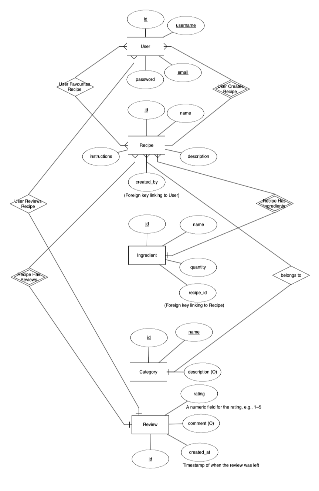

# Sizzle – Recipe Manager

## Table of Contents
1. [Overview](#overview)
2. [User Experience (UX)](#user-experience-ux)
    - [Strategy](#strategy)
    - [Scope](#scope)
    - [Structure](#structure)
    - [Skeleton](#skeleton)
    - [Surface](#surface)
    - [User Experience Enhancements](#user-experience-enhancements)
3. [Agile Development](#agile-development)
    - [Epics](#epics)
    - [User Stories](#user-stories)
    - [Tasks](#tasks)
    - [Acceptance Criteria](#acceptance-criteria)
4. [Features](#features)
5. [Project Iteration Focus](#project-iteration-focus)
6. [Database Schema](#database-schema)
7. [Testing](#testing)
    - [Automated Testing](#automated-testing)
    - [Manual Testing](#manual-testing)
    - [Bug Fixes](#bug-fixes)
8. [Deployment](#deployment)
9. [Project Setup](#project-setup)
10. [Version Control](#version-control)
11. [Credits](#credits)

---

## Overview

Sizzle is a Recipe Manager application designed to simplify the storage, retrieval, and management of recipes. It is aimed at cooking enthusiasts, chefs, and home cooks who need a simple, user-friendly platform to add, edit, view, and delete recipes while keeping track of their favourite dishes.

The main goals of this project are:
- To provide users with a seamless experience to manage their recipes.
- To create an efficient full-stack application with CRUD functionality.
- To ensure the application is secure, responsive, and easy to use.

**Target Audience**:
- Cooking enthusiasts
- Chefs and culinary professionals
- Home cooks

**Purpose**:  
Sizzle provides a platform where users can manage their recipes in an intuitive and easy-to-navigate interface, with full control over the CRUD functionalities of the recipes.

**Sizzle** is designed to be a comprehensive recipe management platform that empowers users to discover, create, and organise their culinary creations. The platform offers an intuitive and user-friendly interface, making it easy for both novice and experienced cooks to manage their recipes effortlessly. 

With **Sizzle**, users can:

- **Create Recipes**: Users can easily input their favourite recipes, including ingredients, preparation steps, and even images, allowing them to keep all their cooking inspirations in one place.
- **Read and Edit Recipes**: The application provides the functionality to view and edit existing recipes, ensuring that users can update their creations with new tips or ingredients.
- **Delete Recipes**: Users have full control over their recipe collection, enabling them to delete recipes they no longer want to keep, thereby maintaining a clean and organised space.
- **Intuitive Navigation**: The interface is designed for easy navigation, allowing users to quickly find recipes through a search function.
- **User Management**: The platform includes user authentication, allowing users to create accounts, log in, create, update and rate recipes securely.
- **Responsive Design**: Built with Bootstrap, **Sizzle** ensures a seamless experience across various devices, whether on a desktop, tablet, or mobile phone.

Ultimately, **Sizzle** aims to be the go-to solution for food enthusiasts looking to streamline their cooking process, explore new recipes, and share their culinary journey with others.

---

## User Experience (UX)

### Strategy
The strategy was to design an application that provides value to users who want to manage their recipe collections. This includes adding, updating, deleting, and favouriting recipes, as well as viewing all available recipes.

### Scope
The scope focuses on core functionalities such as:
- User registration, login, and logout.
- Adding and managing recipes with CRUD functionality.
- Search and filtering options to quickly find recipes.
- User feedback through form validations and process confirmations.

### Structure

The structure of **Sizzle** follows a clear and intuitive navigation system, which has been meticulously designed to enhance user experience. The main navigation bar is prominently displayed at the top of the interface, allowing users to access key functionalities with ease. 

- **Logical Layout**: Each section of the application is organised in a logical manner, enabling users to seamlessly transition between creating, viewing, editing, and deleting recipes without confusion.
- **Search Functionality**: A search feature is integrated, allowing users to quickly locate specific recipes or ingredients, thereby saving time and enhancing usability.
- **User-Friendly Website**: The layout has been strategically placed to provide visual cues, improving accessibility and making navigation more intuitive for users of all ages and technical abilities.

### Surface

The surface design of **Sizzle** adheres to modern design principles, effectively utilising Bootstrap to ensure both responsiveness and accessibility across various devices. 

- **Responsive Design**: The layout automatically adjusts to fit different screen sizes, providing an optimal viewing experience whether accessed on a desktop, tablet, or mobile device. This ensures that users can manage their recipes on-the-go without compromising functionality.
- **Clean and Minimalistic Aesthetic**: The chosen colour scheme features soft, neutral tones complemented by vibrant accents, reflecting a clean and minimalistic approach that is both aesthetically pleasing and easy on the eyes. This design choice helps to focus user attention on the content, rather than being distracted by overly complex visuals.
- **Thoughtful Typography**: The typography is carefully selected to enhance readability and user engagement. A combination of modern serif and sans-serif fonts adds character to the interface while ensuring that text remains clear and legible.
- **Visual Hierarchy**: Key elements such as headings, buttons, and links are designed to stand out, creating a clear visual hierarchy that guides users through their interactions with the application.

### User Experience Enhancements

#### URL Slugs for Recipe Details
To enhance the user experience and improve SEO (Search Engine Optimisation), we implemented a URL slug feature for individual recipe pages. Instead of displaying the recipe ID or a generic query parameter in the URL, users can now see a human-readable URL that includes the recipe title. This not only makes the URLs more descriptive but also easier to share.

For example, when a user clicks on a recipe, the URL changes from:

`/recipes/1` to `/recipes/chocolate-chip-cookies`

**Steps taken:**
1. **Slug Field in the Model:** We added a slug field to the `Recipe` model, which automatically generates a URL-friendly version of the recipe title.
2. **Slug Generation:** Slugs are generated using Django's `slugify` function when a recipe is created or updated.
3. **URL Configuration:** The recipe detail page's URL pattern was updated to accept slugs instead of the numeric ID, ensuring a cleaner and more user-friendly URL structure.
4. **Navigation Links Updated:** All links to individual recipes were updated to point to the new slug-based URLs.

This enhancement improves the website's usability, makes URLs more memorable, and optimises the site for search engines.


#### Pagination for Recipes
We implemented pagination to break down the list of recipes into multiple pages. This improves loading performance and provides a more structured browsing experience for users. By default, the recipe listing page now shows a limited number of recipes per page, with controls to navigate between pages.

#### Cloudinary Integration
We integrated Cloudinary for image hosting, which allows you to upload and display high-quality images for recipes. This enhances the visual appeal of the site, especially on the recipe detail pages, where images are displayed.

#### Heroku Deployment
The project is deployed on Heroku, and we ensured that the necessary environment variables (like the Cloudinary API keys) are set correctly in Heroku’s configuration to support image hosting and ensure smooth functionality.

#### Dropdown Menu for Recipe Categories
A dropdown menu was added to allow users to view and select categories when they visit a recipe’s page. This categorisation helps users quickly identify and navigate between different types of recipes, like “Dessert,” “Main Course,” or “Vegetarian.”

#### Fixing Static File and CSS Issues on Heroku
We encountered issues with CSS and image formatting when deployed to Heroku. These issues were resolved by ensuring that static files were properly collected and that Cloudinary image URLs were correctly configured.


## Agile Development

### Epics
The development process was guided by the following epics:
1. Manage Recipes (CRUD functionalities).
2. User Authentication (Registration, Login, Logout).
3. Search and Filter Recipes.

### User Stories

1. **Add a Recipe**  
   As a user, I want to be able to add a new recipe so that I can manage my favourite dishes. This functionality allows users to input details such as the recipe name, ingredients, instructions, and images, ensuring they can easily keep track of their culinary creations.
2. **View All Recipes**  
   As a user, I want to view all recipes so I can browse and find new dishes to cook. This feature provides an overview of all available recipes in a visually appealing layout, making it easy for users to discover new meals.
3. **Edit a Recipe**  
   As a user, I want to edit an existing recipe so I can update details like ingredients or instructions. This capability enables users to refine their recipes based on feedback or personal preferences, ensuring their recipe collection remains relevant and accurate.
4. **Delete a Recipe**  
   As a user, I want to delete a recipe that I no longer need. This functionality allows users to maintain a clean and organised recipe collection, removing any unwanted or outdated recipes effortlessly.
5. **Search for a Recipe**  
   As a user, I want to search for a recipe based on a keyword or ingredient. This feature enhances user experience by providing a quick and efficient way to find specific recipes, tailored to their current cravings or available ingredients.
6. **User Login**  
   As a user, I want to log in to my account so I can access my saved recipes and personal preferences. This feature ensures that users can securely access their accounts and manage their recipes.
7. **User Logout**  
   As a user, I want to log out of my account when I finish using the application. This functionality provides users with the ability to securely exit their accounts, ensuring their data remains protected.
8. **User Registration**  
   As a new user, I want to register for an account so that I can start managing my recipes. This feature includes an easy sign-up process that captures necessary information, allowing new users to create an account quickly.
9. **Pagination**  
   As a user, I want to navigate through multiple pages of recipes to find new dishes without overwhelming the interface. This functionality allows for a smooth browsing experience, displaying a manageable number of recipes per page.
10. **Recipe Rating**  
   As a user, I want to rate recipes based on my experience, so I can provide feedback and help others choose the best dishes. This feature enables users to share their opinions, creating a community-driven rating system that enhances recipe discovery.
11. **View Recipe Details**  
   As a user, I want to view detailed information about a specific recipe so that I can understand its ingredients, preparation steps, and any additional notes. This feature allows users to click on a recipe to see comprehensive details, ensuring they have all the information needed to recreate the dish.   

### Tasks

To ensure a systematic and efficient development process, tasks for each user story were meticulously broken down into smaller, manageable sections. This approach allowed for focused work on individual features while facilitating incremental progress. Each task was prioritised based on its importance to the user experience and was assigned to team members to maximise productivity. 

The iterative nature of this development process enabled regular testing and feedback, allowing for adjustments to be made based on user needs and preferences. This continuous integration ensured that features were refined and improved upon before moving on to subsequent tasks. 

You can view the detailed breakdown of tasks, including assigned responsibilities and completion status, on the [GitHub project board](https://github.com/users/fraserivison/projects/3). This transparency provides insight into the development process and helps track progress towards project completion.

### Acceptance Criteria

Each user story is accompanied by specific acceptance criteria designed to ensure that functionality operates as intended and meets user expectations. These criteria serve as a benchmark for testing and validation, allowing developers to verify that the implemented features align with user requirements. 

The acceptance criteria for each user story include:

- **Feedback Loops**: Users receive immediate and clear feedback on their actions. For example, when a user adds or deletes a recipe, they are shown a confirmation message, ensuring they are aware of the success or failure of their actions.

- **Data Validation**: Input fields are rigorously validated to ensure all necessary information is provided and correctly formatted. This prevents errors during recipe management, such as incomplete submissions or invalid data types, enhancing the overall robustness of the application.

- **User Notifications**: Clear and concise notifications are displayed to users, informing them of the results of their actions. Whether it’s a successful login, an error message during registration, or confirmation of a recipe edit, these notifications guide users through their interactions with the application.

These acceptance criteria not only enhance the functionality of **Sizzle** but also contribute to an intuitive and user-friendly experience, ensuring that users can manage their recipes effortlessly and with confidence.


---

## Features

## Features

**Sizzle** includes the following key features:

- **Recipe Management**: 
  Users can effortlessly add new recipes, edit existing ones, and delete those they no longer wish to keep. This feature provides an intuitive interface for managing personal recipe collections, ensuring users can keep their culinary creations organised.
  

- **Search Functionality**: 
  The platform allows users to search for recipes based on keywords, making it easy to find specific dishes or ingredients. This feature enhances user experience by enabling quick access to desired recipes without scrolling through the entire list.
  

- **Favourite Recipes**: 
  Users can mark their favourite recipes for quick and easy access. This feature is particularly useful for those who often revisit certain dishes and want to streamline their cooking experience.
  

- **User Authentication**: 
  The application offers secure registration, login, and logout functionalities. User authentication ensures that each individual's recipe collection remains private and secure, while also providing a personalised experience.
  

### Features To Be Implemented

- **Filter Recipes by Category**: 
  This upcoming feature will allow users to filter recipes based on categories such as cuisine type, dietary preferences, or meal types. This functionality aims to enhance usability by enabling users to discover recipes that best fit their specific needs and occasions.
  

- **User Home Page**: 
  The implementation of a dedicated user home page will offer a personalised space for users to view their favourite recipes, recently added dishes, and suggested recipes based on their cooking history. This feature aims to enhance user engagement and streamline access to frequently used functionalities.
  

- **Recipe Rating**: 
  A rating system will be introduced, allowing users to rate recipes based on their experience. This feature will help others gauge the popularity and quality of recipes, promoting community engagement and interaction.
  


---

## Project Iteration Focus

### Removal of Category Field

In this iteration of Sizzle, the **category** field was removed from the recipe model and forms. This decision was made to streamline the project's current scope and focus on delivering core functionalities that enhance user experience without adding unnecessary complexity.

### Rationale for Removal

1. **Simplicity**: Removing the category field allows for a simpler user interface and reduces the cognitive load on users when browsing recipes. By focusing on essential features, users can navigate the application more easily and efficiently.

2. **Core Functionalities**: This iteration prioritises the implementation of crucial functionalities, including:
   - User registration and authentication
   - Recipe creation, reading, updating, and deletion (CRUD operations)
   - Search functionality to quickly find recipes based on titles and descriptions

3. **Future Enhancements**: While the category feature is not included in this iteration, it remains a potential enhancement for future versions of the project. This decision allows for the opportunity to revisit the category feature later, ensuring that it can be thoughtfully integrated when the project is further developed.


## Database Schema

The following Entity Relationship Diagram (ERD) illustrates the data model for the Sizzle application, showcasing the relationships between different entities.


<p>Entity Relationship Diagram (ERD).</p>

### Description of Entities

- **User**: Handles user authentication and profile data.
- **Recipe**: Stores recipe details including name, ingredients, and instructions.
- **Favourite**: Stores the relationship between users and their favourite recipes.

The database is a PostgreSQL relational database, fully normalised, with three core models:

- **User Model**: Manages user data.
- **Recipe Model**: Stores all recipe-related fields.
- **Favourite Model**: Links users to their favourite recipes.


## Testing

Test update to trigger a commit.

### Automated Testing

Automated testing is an essential part of the development process in this Recipe Manager project. It ensures that the application behaves as expected and allows us to identify and fix issues quickly. We utilise Django's built-in testing framework to create comprehensive tests for various components of the application, covering both forms and views.The implemented tests cover critical functionalities of the Recipe Manager, contributing to the overall reliability of the application. Regularly running these tests helps to identify regressions and maintain the integrity of the application as new features are added.

#### Test Cases Implemented

1. **Recipe Form Tests:**
   - **Valid Recipe Form Test:** 
     - This test checks that the recipe form can successfully accept valid input data. The specific fields validated include:
       - Title
       - Description
       - Ingredients
       - Instructions
       - Cooking Time
       - Servings
       - Category
     - The test ensures that the form is valid and that the cleaned data matches the expected values.
   - **Invalid Recipe Form Test:**
     - This test verifies the form's behaviour with invalid data, checking for:
       - Title length exceeding the character limit.
       - Description length exceeding the limit.
       - Missing ingredients and instructions.
       - Negative values for cooking time and servings.
       - Missing category.
     - The test ensures that appropriate error messages are returned for each invalid field.

2. **Slug Generation Tests:**
   - **Slug Creation on Save:**
     - This test ensures that a slug is automatically generated from the recipe title upon saving the recipe.
     - It also checks that the `featured_image` field contains the expected URL format.
     - **Change Made:** During testing, we used a mocked image URL from Cloudinary (`http://example.com/fake-image.jpg`) to simulate image uploads, reflecting our integration with Cloudinary while maintaining a consistent testing environment.

3. **Recipe View Tests:**
   - **Create Recipe View Test:**
     - This test verifies that the recipe creation view is accessible and functions correctly for logged-in users.
     - It ensures that the user is redirected to the login page if they attempt to access the recipe creation page while logged out.
   - **Recipe List View Pagination Test:**
     - This test checks that the pagination feature of the recipe list view works as intended, ensuring that a set number of recipes (6 in this case) is displayed per page.
   - **Recipe Detail View Test:**
     - This test confirms that the recipe detail view retrieves the correct recipe based on its slug and displays its title accurately.

4. **Authentication Tests:**
   - **Signup View Test:**
     - This test verifies that new users can successfully register through the signup view.
     - It checks that upon successful signup, users are redirected appropriately.
   - **Login View Test:**
     - This test confirms that registered users can log in and are redirected to the correct page.
   - **Access Control Test for Create Recipe:**
     - This test ensures that only authenticated users can access the recipe creation page, reinforcing security in the application.

## 5. Error Handling Tests:
- **Form Error Handling Tests:**
  - This test checks that the appropriate error messages are returned for missing required fields in the recipe form, ensuring robust validation and user feedback.

## 6. Edge Cases for Views:
- **Recipe Editing and Deleting Tests:**
  - These tests confirm that users can successfully edit existing recipes and delete them when required. They also check for the appropriate redirection and error handling in these processes.

#### Changes Made

- **Mocking Cloudinary Uploads:** 
  - To streamline testing and avoid dependencies on external services, we implemented mocks for Cloudinary's upload functionality. By using a placeholder image URL (`http://example.com/fake-image.jpg`), we could simulate image uploads without requiring actual file uploads during tests. This adjustment ensured that our tests remained fast and reliable.


### Manual Testing

#### User Model Testing
Testing of the user model was carried out through the Django Admin Dashboard to ensure that all user-related functionalities are working correctly. This includes:

- **Creating Users:** Users were successfully created through the admin panel, with the necessary fields (username, email, password) validated as expected.
- **Deleting Users:** Users were deleted, and the system correctly removed the associated data without errors.
- **Editing Users:** User information was modified through the admin panel, and changes were reflected immediately in the application.

#### Recipe Model Testing
The recipe model was thoroughly tested through manual operations using the Django Admin Dashboard as well as the front-end user interface. The following functionalities were tested:

- **Adding Recipes:** Recipes were successfully added to the database, with all required fields (title, ingredients, instructions) validated. Upon creation, the recipes were available for viewing on the front end.
- **Editing Recipes:** Recipes were edited both in the admin dashboard and through the front-end interface. The changes made were reflected instantly in the application and updated in the database.
- **Deleting Recipes:** Recipes were deleted from the system using both the admin dashboard and the front-end interface. The deletion process correctly removed the recipe from the database and updated the recipe list for all users.
- **Viewing Recipes:** Users were able to view all recipes, which were displayed in the order of their creation date. The recipes were tested to ensure that all fields were displayed correctly on the front-end interface, including titles, images, ingredients, and instructions.

#### User Registration and Authentication Testing

Testing for user registration, login, and logout functionalities was completed:

1. **User Registration**:
   - Navigated to the Sign-Up page and filled in the required fields (username, email, password, confirm password).
   - Submitted the form successfully, and a new user was created.
   - Verified the user was redirected to the appropriate page after registration.
   - Checked for validation messages for empty or incorrectly formatted fields.

2. **User Login**:
   - Accessed the Log-In page and entered valid credentials.
   - Successfully logged in and was redirected to the index page.
   - Attempted to log in with incorrect credentials, ensuring appropriate error messages were displayed.

3. **User Logout**:
   - Logged out from the application.
   - Confirmed redirection to the index page after logging out.
   - Verified that the user was no longer authenticated by checking for the login/signup links in the navigation bar.

Overall, all authentication features are functioning as expected.

- **Registering Users:** The registration form collects and validates user information. Once registered, new users can log in with their credentials.
- **Logging In:** Users can log in with valid credentials and are redirected to the correct page after login.
- **Logging Out:** Users can successfully log out, and the system redirects them to the homepage.

### Search Functionality Testing
The search functionality was rigorously tested to ensure a seamless user experience. The testing process included:

- **Search for Recipes:** Users can search for recipes by entering keywords into the search bar. The system is designed to accurately return a list of matching recipes based on the search input. During testing, various keywords were inputted, and the results were verified to ensure that all relevant recipes were displayed. This functionality was tested with different combinations of keywords, including partial matches and exact matches, confirming that the search algorithm performs as expected.

### Favourite Recipes Testing
The favourite recipes feature was tested thoroughly to validate its functionality and user experience:

- **Adding to Favourites:** Users can easily add a recipe to their list of favourites by clicking the 'Add to Favourites' button on the recipe detail page. The system successfully updates the favourites section, displaying the newly added recipe. Testing included verifying that the correct recipe appears in the favourites list after addition, ensuring that the user experience is intuitive and responsive.

- **Removing from Favourites:** Users have the option to remove recipes from their favourites. This action is performed by clicking the 'Remove from Favourites' button. Upon removal, the UI updates immediately to reflect the change, confirming that the recipe is no longer listed in the favourites section. This functionality was tested to ensure that it works seamlessly, maintaining data integrity and providing real-time feedback to users.

### Responsive Design Testing
The website's responsive design was evaluated across multiple devices and screen sizes to guarantee an optimal user experience:

- **Mobile, Tablet, and Desktop Views:** The site layout adjusts correctly for mobile phones, tablets, and desktop computers, ensuring that all content remains accessible and functional regardless of the device used. Testing involved accessing the site on various screen sizes and orientations, verifying that all elements, including images, text, and buttons, scale appropriately. This testing confirmed that the site maintains usability and aesthetic appeal across all devices.

### Navigation Testing
The navigation bar was thoroughly tested to ensure smooth user navigation throughout the site:

- **Navigation Bar:** The navigation bar was evaluated for functionality across all pages of the website. Users can access all areas of the site seamlessly through the navigation links. Testing included checking that all links direct users to the correct pages and that dropdown menus function as intended. The navigation bar's responsiveness was also assessed to ensure it remains user-friendly on different devices, providing an efficient way for users to explore the site’s content.

### Bug Fixes

Throughout the development of the Recipe Manager project, several bugs and issues were identified and resolved to enhance the application's functionality and user experience. Below are the notable bugs that were fixed along with the solutions implemented:

#### 1. **Image Display Issues on Heroku**
   - **Issue:** Images uploaded using Cloudinary were not displaying correctly on Heroku, appearing distorted or missing entirely.
   - **Solution:** The issue was traced back to the incorrect formatting of Cloudinary URLs in the application. By reviewing the code that handled image URLs, we ensured that the correct Cloudinary image path was used and removed any unnecessary transformations. This adjustment allowed the images to render correctly in the deployed application.

#### 2. **User Authentication Issues**
   - **Issue:** Users experienced difficulties logging in or signing up, particularly related to username handling.
   - **Solution:** After implementing Django Allauth for authentication, we found that usernames were not being saved correctly. We addressed this by setting `ACCOUNT_USERNAME_REQUIRED = True` in the `settings.py` file, ensuring that usernames were mandatory during the signup process. This change allowed for smoother user registration and login experiences.

#### 3. **Pagination in Recipe List View**
   - **Issue:** The pagination functionality for the recipe list view was not returning the expected number of recipes per page.
   - **Solution:** We discovered that the view function was not correctly passing the paginated object to the template. By updating the view to properly handle pagination, we ensured that the correct number of recipes (6 per page) was displayed, enhancing usability for users browsing through multiple recipes.

#### 4. **Slug Generation Failures**
   - **Issue:** Slugs for recipes were not being generated as expected upon saving new recipes.
   - **Solution:** We implemented unit tests to verify the slug generation logic. After identifying that the slug was not being created consistently, we modified the recipe model to ensure that the slug was derived from the recipe title during the save process. This fix improved the consistency of recipe URLs, making them more user-friendly.


## Deployment

The project was deployed using Heroku. Below is the deployment process:

1. Create a new Heroku app.
2. Link the Heroku app to the GitHub repository.
3. Set up environment variables (`DATABASE_URL`, `SECRET_KEY`, etc.).
4. Configure the `Procfile` and install necessary packages listed in `requirements.txt`.
5. Deploy the app and verify it runs without issues.

---

### Project Setup

After setting up the project and running migrations, you can load predefined recipes into the database for faster testing or to populate the website with sample content.

1. **Run Migrations**: Ensure your database is up to date by running the following command:

    ```bash
    python manage.py migrate
    ```

2. **Load Predefined Recipes**: To quickly populate your database with sample recipes, use the `loaddata` command with the `recipes.json` file. This file contains predefined recipe entries that will help you see how the application behaves with actual data. Run the following command:

    ```bash
    python manage.py loaddata recipes.json
    ```

   This command will read the data from `recipes.json` and insert it into your database, creating two sample recipes: "Spaghetti Carbonara" and "Chicken Curry." You can modify or add more recipes to this JSON file as needed.

3. **Verify the Data**: After loading the data, you can check the Django admin panel to see the recipes listed under the Recipes section. This will allow you to quickly verify that your setup is working correctly.

By following these steps, you will have a functional setup with sample data ready for testing and development.


## Version Control

The project used Git for version control, with frequent and small commits to ensure that changes were well tracked. Each commit message is clear and descriptive, making it easy to follow the project’s development.

Key files:
- `Procfile`
- `requirements.txt`
- `.gitignore`
- `env.py` (environment variables are stored here, which is not included in version control).

---

## Credits
- Images used in this project were sourced from Google Images. All images are for illustrative purposes only and may be subject to copyright.


- **Libraries and Frameworks**:  
  The following libraries and frameworks were utilised to build this project:
  - **Django**: A high-level Python web framework that encourages rapid development and clean, pragmatic design.
  - **PostgreSQL**: An advanced, open-source relational database management system.
  - **Bootstrap**: A popular front-end framework for developing responsive and mobile-first websites.
  - **Cloudinary**: A cloud-based service for managing images and videos, providing efficient storage and delivery.

- **Icons and Fonts**:  
  - [FontAwesome](https://fontawesome.com) - Icon toolkit used for adding icons to the user interface.
  - [Google Fonts](https://fonts.google.com) - Custom fonts were sourced from Google Fonts to enhance the typography of the website.

- **Documentation and Resources**:  
  - [Django Documentation](https://docs.djangoproject.com) - Official documentation for the Django framework, used as a reference throughout the project.
  - [Bootstrap Documentation](https://getbootstrap.com/docs) - Official Bootstrap documentation for guidance on component usage and layout.


- **Acknowledgements**:  
  Special thanks to the Full-Stack Development team and mentors for their guidance.

## End.

[Back to TOP](#table-of-contents)